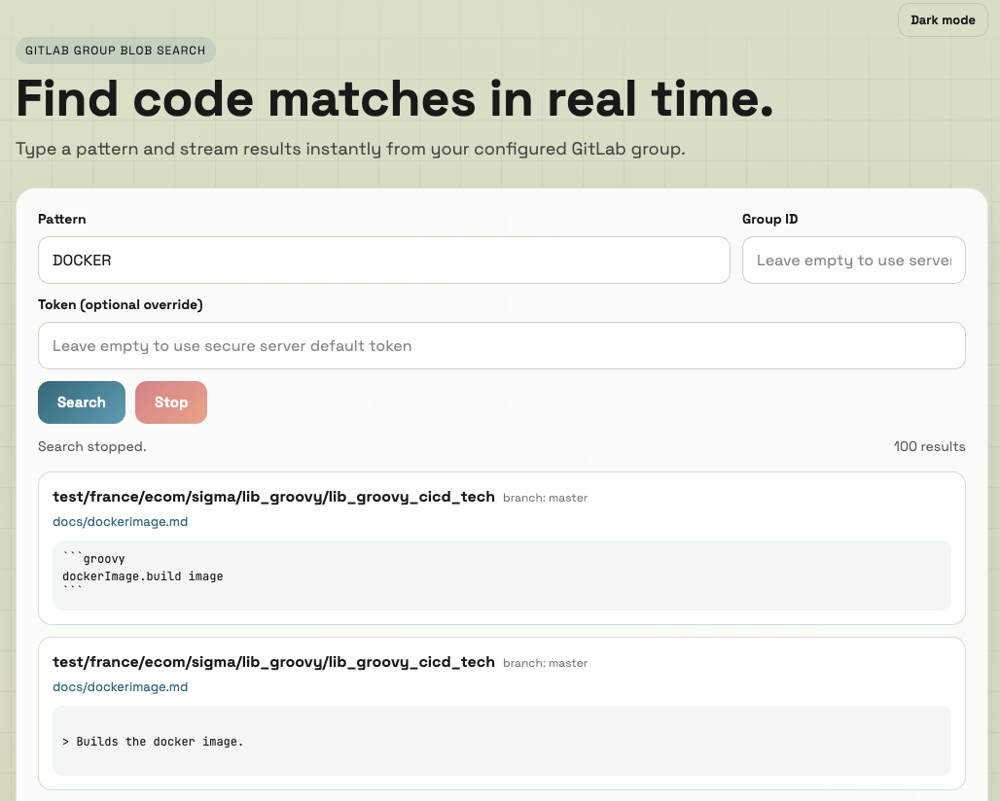
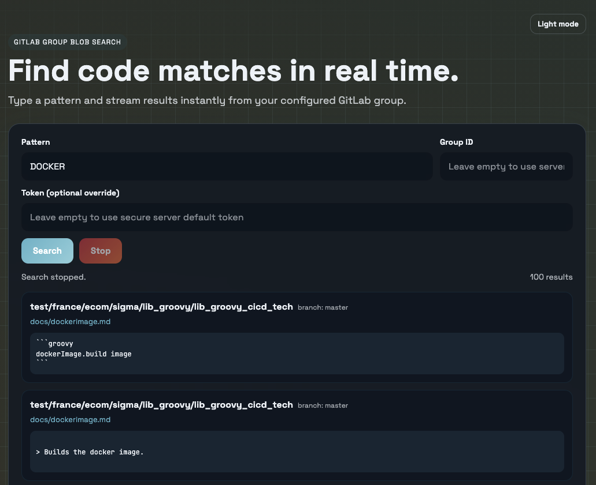

# gitlabSearch

A real-time GitLab code search web app for teams.

Search `scope=blobs` across a GitLab group, stream matches live, stop anytime, and open results directly at the exact file line.

## Highlights

- Real-time streaming results (incremental rendering)
- Stop/abort search from the UI
- Search by pattern with editable `Group ID`
- Optional token override in UI
- Light/Dark mode toggle in UI
- Secure server-side default token from environment variables
- Automatic pagination (`X-Next-Page`)
- Direct links to GitLab files with line anchors

## Tech Stack

- Backend: Go (`net/http`)
- Streaming protocol: NDJSON over HTTP POST
- Frontend: Vanilla HTML/CSS/JS (responsive, modern UI)

## Demo Flow

1. Open the app at `http://localhost:8080`
2. Enter search pattern (required)
3. Confirm or update Group ID (default: `XXXXXX`)
4. Optionally provide a token override
5. Click `Search` and watch results stream in real time
6. Click `Stop` to abort instantly

## Demo Screenshots

### Light Mode



### Dark Mode



## Quick Start

```bash
git clone git@github.com:f1rstsurf/gitlabSearch.git
cd gitlabSearch
cp .env.example .env
```

Set environment variables (or load `.env` with your preferred tool):

```bash
export GITLAB_TOKEN='glpat-...'
export GITLAB_GROUP_ID='XXXXXX'
go run .
```

Open:

```text
http://localhost:8080
```

## Configuration

| Variable | Required | Default | Description |
|---|---|---|---|
| `GITLAB_TOKEN` | Yes* | - | Secure server-side default token used when UI token is empty |
| `GITLAB_GROUP_ID` | Yes* | - | Default group ID when UI group is empty |
| `GITLAB_BASE_URL` | No | `https://gitlab.com/api/v4` | GitLab API base URL |
| `GITLAB_WEB_URL` | No | Derived from `GITLAB_BASE_URL` | Base URL for clickable file links |
| `APP_THEME` | No | `light` | Default UI theme (`light` or `dark`) |
| `PORT` | No | `8080` | Server port |

`*` Required unless you always provide token from UI.

## API

### `POST /api/search/stream`

Request body:

```json
{
  "pattern": "terraform_deploy",
  "group_id": "XXXXXX",
  "token": "optional-ui-override-token"
}
```

Response is NDJSON (`application/x-ndjson`) with messages like:

```json
{"type":"status","message":"Searching for \"terraform_deploy\" in group XXXXXX"}
{"type":"result","result":{"repo":"my/group/repo","branch":"main","path":"path/file.tf","url":"https://gitlab.com/...","line":12,"data":"matched snippet"}}
{"type":"done","total":42}
```

## Security

- UI token is sent in POST body, not in URL query params
- Prefer server-side `GITLAB_TOKEN` for normal usage

## Development

Format and build:

```bash
gofmt -w main.go
go build ./...
```

## License

MIT
